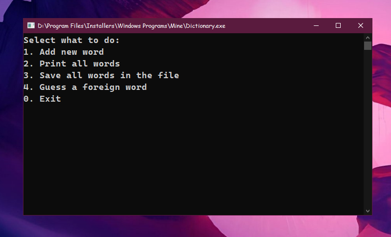

# 📙 Dictionary

**Dictionary** is an application that helps you store foreign words along with their translations.

---

## ⚙ Technical Information
- This project is written in pure **C++**

---

## ✨ Features

- 💾 Saves and loads all your saved words
- 📥 Allows you to export all words and their translations to a separate file
- 🎮 Includes a mini-game to test your knowledge using the words you've already added
- 📃 Displays a full list of your saved vocabulary

---

## 📁 Project Status
✅ Completed